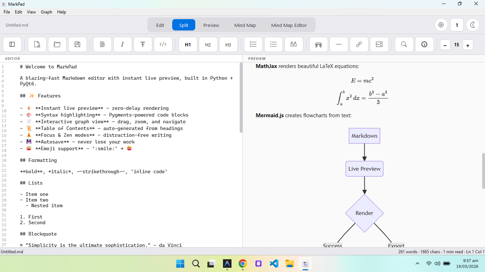
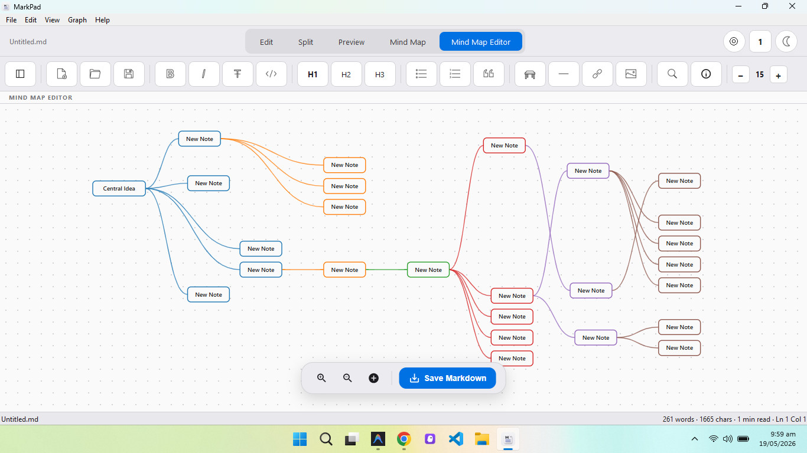
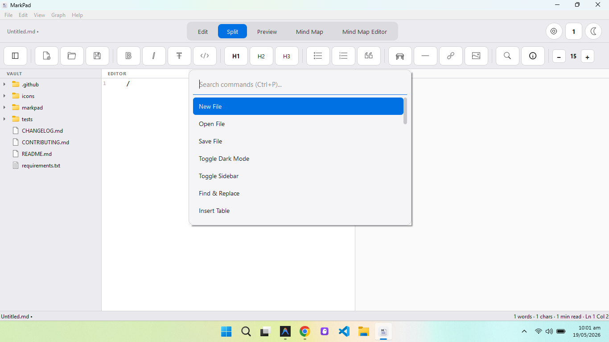
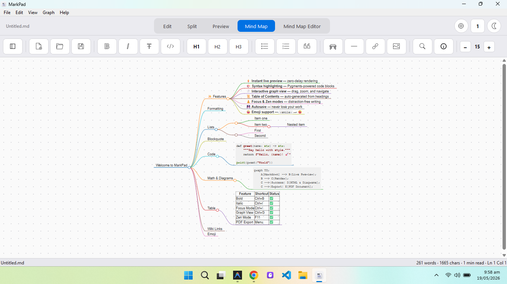
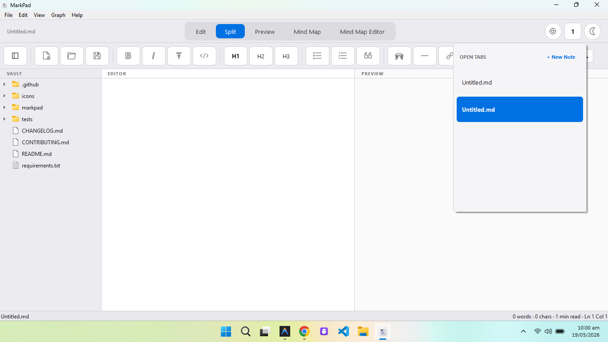
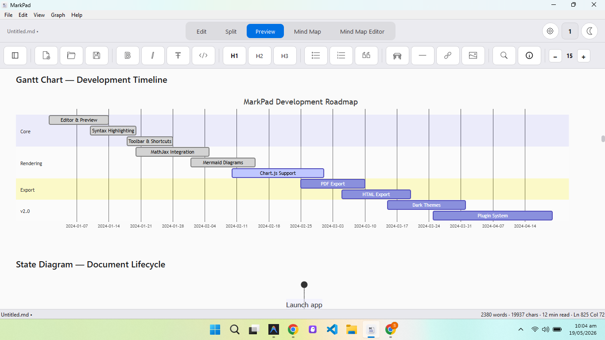
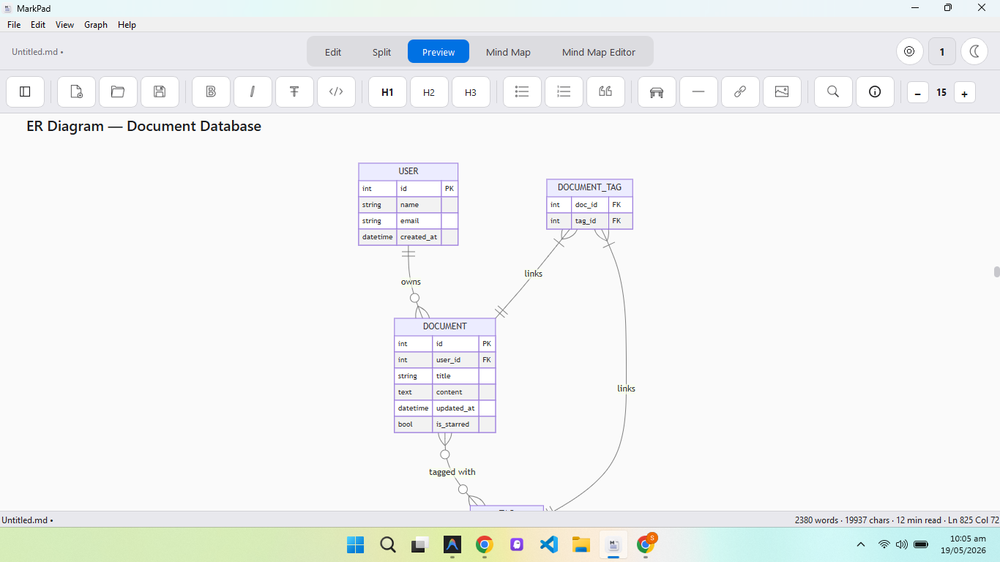
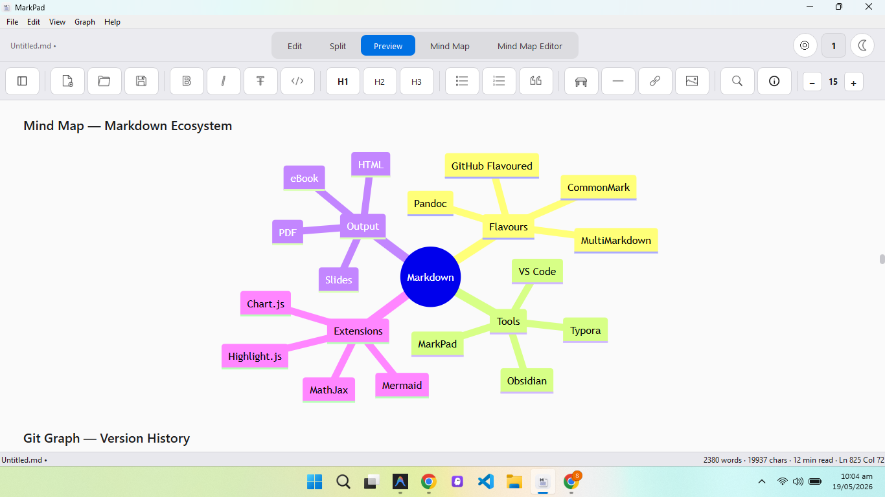

<p align="center">
  
</p>

<h1 align="center">MarkPad</h1>

<p align="center">
  <strong>A blazing-fast, beautiful Markdown editor with instant live preview.</strong>
  <br />
  Built with Python + PyQt6 · Open Source · Cross-Platform
</p>

<p align="center">
  <a href="LICENSE"></a>
  <a href="https://python.org"></a>
  <a href="https://github.com/zamin-naqvi/MarkPad/actions"></a>
  <a href="https://github.com/zamin-naqvi/MarkPad/releases"></a>
  <a href="https://github.com/zamin-naqvi/MarkPad/stargazers"></a>
  <a href="https://github.com/zamin-naqvi/MarkPad/issues"></a>
  <a href="https://github.com/zamin-naqvi/MarkPad/pulls"></a>
</p>

<p align="center">
  <a href="#-quick-start">Quick Start</a> •
  <a href="#-features">Features</a> •
  <a href="#%EF%B8%8F-keyboard-shortcuts">Shortcuts</a> •
  <a href="#-architecture">Architecture</a> •
  <a href="#-contributing">Contributing</a> •
  <a href="#-license">License</a>
</p>

---

## 🎬 Overview

**MarkPad** is a feature-rich, performance-first Markdown editor designed for writers, developers, and knowledge workers. It delivers **instant live preview** with zero-delay rendering, powered by an incremental DOM-diffing engine that only updates what's changed — no full page reloads, no flickering.

### 📸 Screenshots

| Split View | Mind Map Editor |
|:---:|:---:|
|  |  |

| Command Palette | Markdown Mindmap |
|:---:|:---:|
|  |  |

| Multi-Tab Interface | Gantt Chart |
|:---:|:---:|
|  |  |

| ER Diagram | Image |
|:---:|:---:|
|  |  |

### Why MarkPad?

- ⚡ **Zero-delay preview** — Incremental rendering with DOM diffing, not page reloads
- 🏗️ **Production-ready** — Modular architecture, tested, CI/CD pipeline
- 🧠 **Mind Map Editor** — Visual brainstorming with drag-and-drop node editing
- 📊 **Rich content** — MathJax equations, Mermaid diagrams, Chart.js charts
- 🎨 **Beautiful design** — Apple-inspired UI with dark/light themes
- 🔌 **Extensible** — Clean plugin-friendly architecture

---

## 🚀 Quick Start

### Prerequisites

- **Python 3.9** or higher
- **pip** (Python package manager)
- **Git** (optional, for cloning)

### Installation

#### Option 1: Clone & Run (Recommended)

```bash
# Clone the repository
git clone https://github.com/zamin-naqvi/MarkPad.git
cd MarkPad

# Create a virtual environment (recommended)
python -m venv venv

# Activate virtual environment
# Windows:
venv\Scripts\activate
# macOS/Linux:
source venv/bin/activate

# Install dependencies
pip install -r requirements.txt

# Launch MarkPad
python main.py
```

#### Option 2: Install as Package

```bash
# Install from source
pip install -e .

# Run from anywhere
markpad
```

#### Option 3: Download Release

Download the latest pre-built binary from the [Releases](https://github.com/zamin-naqvi/MarkPad/releases) page — no Python installation required.

### Verify Installation

```bash
python -c "import markpad; print(f'MarkPad v{markpad.__version__} installed successfully')"
```

---

## ✨ Features

### Core Editing

| Feature | Description | Shortcut |
|---------|-------------|----------|
| ⚡ **Instant Live Preview** | Zero-delay incremental rendering with DOM diffing | Auto |
| 🎨 **Syntax Highlighting** | Pygments-powered code block coloring (100+ languages) | Auto |
| 🔍 **Find & Replace** | Full find and replace with case/regex support | `Ctrl+F` |
| ✂️ **Snippets** | Quick-insert tables, code blocks, diagrams, math | `/` slash menu |
| ↩️ **Undo/Redo** | Full undo/redo history | `Ctrl+Z` / `Ctrl+Y` |
| 💾 **Autosave** | Automatic save every 30 seconds | Auto |
| 📂 **Multi-Tab** | Work on multiple documents simultaneously | Tab switcher |
| 📝 **Line Numbers** | Synchronized line number gutter | Auto |

### Writing Modes

| Mode | Description | Shortcut |
|------|-------------|----------|
| ✍️ **Split View** | Side-by-side editor and preview | Tab bar |
| 👁️ **Preview Only** | Full-width rendered preview | Tab bar |
| ✏️ **Edit Only** | Full-width editor | Tab bar |
| 🧘 **Zen Mode** | Fullscreen distraction-free writing | `F11` |
| 🎯 **Focus Mode** | Dims everything except current paragraph | `Ctrl+/` |
| ⌨️ **Typewriter Mode** | Keeps cursor centered vertically | `Ctrl+T` |

### Visualization & Diagrams

| Feature | Description |
|---------|-------------|
| 🕸️ **Interactive Graph View** | D3.js force-directed graph — drag, zoom, click to navigate |
| 🧠 **Mind Map View** | Auto-generated mind map from document headings |
| 🧩 **Mind Map Editor** | Interactive visual brainstorming with drag-and-drop nodes |
| 📊 **MathJax LaTeX** | Beautiful mathematical equations (`$$E=mc^2$$`) |
| 📈 **Mermaid.js Diagrams** | Flowcharts, sequence diagrams, Gantt charts from text |
| 📉 **Chart.js Charts** | Bar, line, pie charts from JSON data |

### Rich Markdown Support

| Feature | Syntax |
|---------|--------|
| **Bold / Italic / Strike** | `**bold**` / `*italic*` / `~~strike~~` |
| **Tables** | GFM-style pipe tables |
| **Task Lists** | `- [ ] task` / `- [x] done` |
| **Footnotes** | `text[^1]` with `[^1]: note` |
| **Admonitions** | `!!! note "Title"` callout boxes |
| **Definition Lists** | `Term` + `:   Definition` |
| **Abbreviations** | `*[HTML]: Hypertext Markup Language` |
| **Wiki Links** | `[[page name]]` Obsidian-style linking |
| **Emoji** | `:rocket:` → 🚀 shortcode support |
| **Math Equations** | `$inline$` and `$$display$$` LaTeX |
| **YAML Frontmatter** | Document metadata support |
| **Markdown in HTML** | Nest Markdown inside HTML blocks |

### Export & Output

| Format | Features |
|--------|----------|
| 📄 **PDF Export** | GitHub, Ace, or LibreOffice themes |
| 🌐 **HTML Export** | Complete standalone HTML with embedded CSS/JS |
| 🧠 **Mind Map Export** | Convert mind map to Markdown headings |

### User Interface

| Feature | Description |
|---------|-------------|
| 🌙 **Dark / Light Theme** | Apple-inspired design with instant toggle |
| ⌨️ **Command Palette** | Quick access to all commands (`Ctrl+P`) |
| 📁 **File Explorer** | Sidebar vault with Markdown file tree |
| 📊 **Status Bar** | Word count, char count, reading time, cursor position |
| 🖼️ **Image Dialog** | Insert local or URL images with preview |
| 🔤 **Font Size Control** | Adjust editor and preview font size in real-time |

---

## ⌨️ Keyboard Shortcuts

### File Operations

| Shortcut | Action |
|----------|--------|
| `Ctrl+N` | New file |
| `Ctrl+O` | Open file |
| `Ctrl+S` | Save file |
| `Ctrl+Shift+S` | Save As |

### Editing

| Shortcut | Action |
|----------|--------|
| `Ctrl+B` | Bold |
| `Ctrl+I` | Italic |
| `Ctrl+Z` | Undo |
| `Ctrl+Y` | Redo |
| `Ctrl+F` | Find & Replace |
| `/` | Slash command menu |

### View & Navigation

| Shortcut | Action |
|----------|--------|
| `Ctrl+P` | Command Palette |
| `Ctrl+G` | Graph View |
| `Ctrl+M` | Mind Map View |
| `Ctrl+/` | Focus Mode |
| `Ctrl+T` | Typewriter Mode |
| `Ctrl+\` | Toggle Sidebar |
| `Ctrl+=` | Increase font size |
| `Ctrl+-` | Decrease font size |
| `F11` | Zen Mode (fullscreen) |

---

## 🏗️ Architecture

MarkPad follows a clean, modular architecture designed for maintainability and extensibility.

### Project Structure

```
MarkPad/
├── main.py                    # Application entry point
├── pyproject.toml             # Package configuration & dependencies
├── requirements.txt           # Pip dependencies
├── MarkPad.spec               # PyInstaller build spec
│
├── markpad/                   # Main application package
│   ├── __init__.py            # Package metadata & version
│   ├── app.py                 # Application bootstrap (QApplication)
│   │
│   ├── core/                  # Core engine & data layer
│   │   ├── engine.py          # Markdown → HTML rendering engine
│   │   ├── document.py        # Document model & recent files
│   │   └── settings.py        # Persistent user settings (JSON)
│   │
│   ├── ui/                    # User interface widgets
│   │   ├── main_window.py     # Main window (menus, toolbar, tabs)
│   │   ├── editor.py          # Editor panel with line numbers
│   │   ├── preview.py         # WebEngine preview panel
│   │   ├── graph_view.py      # D3.js interactive graph
│   │   ├── mind_map_view.py   # Auto-generated mind map
│   │   └── mind_map_editor.py # Interactive mind map editor
│   │
│   ├── dialogs/               # Modal dialogs
│   │   ├── about.py           # About dialog
│   │   ├── command_palette.py # Command palette (Ctrl+P)
│   │   ├── find_replace.py    # Find & Replace dialog
│   │   ├── image_insert.py    # Image insertion dialog
│   │   ├── pdf_export.py      # PDF export with style selection
│   │   ├── slash_menu.py      # Slash command popup menu
│   │   ├── tab_switcher.py    # Multi-tab switcher dialog
│   │   └── how_to_use.py      # Interactive usage guide
│   │
│   ├── themes/                # Theme system
│   │   ├── theme_data.py      # Light/Dark color definitions
│   │   └── stylesheet.py      # Qt stylesheet generator
│   │
│   └── utils/                 # Utilities
│       ├── helpers.py         # Word count, snippets, link extraction
│       └── icons.py           # SVG icon loader
│
├── icons/                     # UI icon assets (SVG)
├── tests/                     # Test suite (pytest)
├── .github/                   # GitHub Actions CI/CD workflows
├── CONTRIBUTING.md            # Contribution guidelines
├── CHANGELOG.md               # Version changelog
├── CODE_OF_CONDUCT.md         # Community code of conduct
├── SECURITY.md                # Security policy
└── LICENSE                    # PolyForm Noncommercial License
```

### Rendering Pipeline

```
┌─────────────────────────────────────────────────────────────────┐
│                     MarkPad Rendering Pipeline                  │
├─────────────────────────────────────────────────────────────────┤
│                                                                 │
│  1. Editor Text Changed                                         │
│       │                                                         │
│       ▼  (10ms debounce)                                        │
│  2. Markdown Pre-processing                                     │
│       • Emoji shortcode replacement (:rocket: → 🚀)             │
│       • Wiki link expansion ([[page]])                          │
│       │                                                         │
│       ▼                                                         │
│  3. Python-Markdown Conversion                                  │
│       • 12 extensions (fenced_code, tables, toc, footnotes...)  │
│       • Pygments syntax highlighting                            │
│       • Block-level caching (MD5 hash per paragraph)            │
│       │                                                         │
│       ▼                                                         │
│  4. HTML Assembly                                               │
│       • Theme-aware CSS injection                               │
│       • Lazy CDN loading (MathJax, Mermaid, Chart.js)           │
│       │                                                         │
│       ▼                                                         │
│  5. Preview Update                                              │
│       • Incremental: JavaScript DOM patching (no reload)        │
│       • Full: setHtml() for first render or theme change        │
│       • Scroll position preserved across updates                │
│                                                                 │
└─────────────────────────────────────────────────────────────────┘
```

### Technology Stack

| Layer | Technology | Purpose |
|-------|-----------|---------|
| **UI Framework** | PyQt6 | Cross-platform native widgets |
| **Preview Engine** | QWebEngineView (Chromium) | HTML/CSS/JS rendering |
| **Markdown Parser** | Python-Markdown 3.5+ | Markdown → HTML conversion |
| **Syntax Highlighting** | Pygments 2.17+ | 500+ language support |
| **Graph Visualization** | D3.js v7 | Interactive force-directed graphs |
| **Math Rendering** | MathJax 3 | LaTeX equation rendering |
| **Diagram Rendering** | Mermaid.js 10 | Flowcharts, sequence diagrams |
| **Chart Rendering** | Chart.js | Data visualization |
| **Emoji** | emoji 2.0+ | Shortcode → Unicode conversion |

---

## 🧪 Testing

```bash
# Run all tests
pytest

# Run with coverage
pytest --cov=markpad --cov-report=html

# Run specific test file
pytest tests/test_engine.py -v

# Type checking (optional)
mypy markpad/ --ignore-missing-imports
```

---

## 🔧 Configuration

MarkPad stores user settings in a platform-specific config directory:

| Platform | Location |
|----------|----------|
| **Windows** | `%APPDATA%\MarkPad\settings.json` |
| **macOS** | `~/Library/Application Support/MarkPad/settings.json` |
| **Linux** | `~/.config/MarkPad/settings.json` |

### Available Settings

| Setting | Type | Default | Description |
|---------|------|---------|-------------|
| `theme` | `string` | `"light"` | Color theme (`"light"` or `"dark"`) |
| `font_size` | `int` | `15` | Editor and preview font size |
| `autosave_enabled` | `bool` | `true` | Enable 30-second autosave |
| `last_directory` | `string` | `""` | Last opened directory |

---

## 📦 Building from Source

### PyInstaller (Standalone Binary)

```bash
# Install PyInstaller
pip install pyinstaller

# Build standalone executable
pyinstaller MarkPad.spec

# Output: dist/MarkPad.exe (Windows) or dist/MarkPad (macOS/Linux)
```

### Development Mode

```bash
# Install in editable mode with dev dependencies
pip install -e ".[dev]"

# Run with hot reload (manual restart required)
python main.py
```

---

## 🛣️ Roadmap

- [ ] Plugin system for custom extensions
- [ ] Collaborative editing (WebSocket)
- [ ] Vim/Emacs keybinding modes
- [ ] Custom CSS theme editor
- [ ] Image paste from clipboard
- [ ] Spell checking integration
- [ ] Git integration (diff view, commit)
- [ ] Presentation mode (slide-by-slide from headings)
- [ ] Voice-to-text dictation
- [ ] AI writing assistant integration

---

## 🤝 Contributing

We welcome contributions of all kinds! Whether it's a bug fix, new feature, documentation improvement, or test case — every contribution matters.

Please read our **[Contributing Guide](CONTRIBUTING.md)** before submitting a pull request.

### Quick Contribution Steps

```bash
# 1. Fork the repository on GitHub
# 2. Clone your fork
git clone https://github.com/YOUR_USERNAME/MarkPad.git
cd MarkPad

# 3. Create a feature branch
git checkout -b feature/amazing-feature

# 4. Make changes and test
pytest

# 5. Commit with conventional commits
git commit -m "feat: add amazing feature"

# 6. Push and open a Pull Request
git push origin feature/amazing-feature
```

See also:
- **[Code of Conduct](CODE_OF_CONDUCT.md)** — Community standards
- **[Security Policy](SECURITY.md)** — Reporting vulnerabilities
- **[Changelog](CHANGELOG.md)** — Version history

---

## 📄 License

MarkPad is released under the **[PolyForm Noncommercial License 1.0.0](LICENSE)**.

### What This Means

| ✅ You **CAN** | ❌ You **CANNOT** |
|----------------|-------------------|
| Download and use for personal projects | Use in commercial products as-is |
| Modify the source code | Sell or redistribute commercially |
| Use for educational purposes | Offer as a hosted/SaaS service |
| Fork and build upon for non-commercial use | Remove license/copyright notices |
| Share with attribution | Claim as your own work |

> **TL;DR** — You can download, study, modify, and use MarkPad for **non-commercial** purposes. If you want to use it commercially, please [contact the maintainers](mailto:zamin-naqvi@example.com) for a commercial license.

---

## 🙏 Acknowledgments

MarkPad is built on the shoulders of incredible open-source projects:

- [PyQt6](https://www.riverbankcomputing.com/software/pyqt/) — Qt bindings for Python
- [Python-Markdown](https://python-markdown.github.io/) — Markdown parser
- [Pygments](https://pygments.org/) — Syntax highlighting
- [D3.js](https://d3js.org/) — Data-driven visualizations
- [MathJax](https://www.mathjax.org/) — Math rendering
- [Mermaid](https://mermaid.js.org/) — Diagrams from text
- [Chart.js](https://www.chartjs.org/) — Chart visualizations

---

<p align="center">
  <strong>Made with ❤️ by <a href="https://github.com/zamin-naqvi">Zamin Naqvi</a></strong>
  <br />
  <sub>If you find MarkPad useful, consider giving it a ⭐ on GitHub!</sub>
</p>
